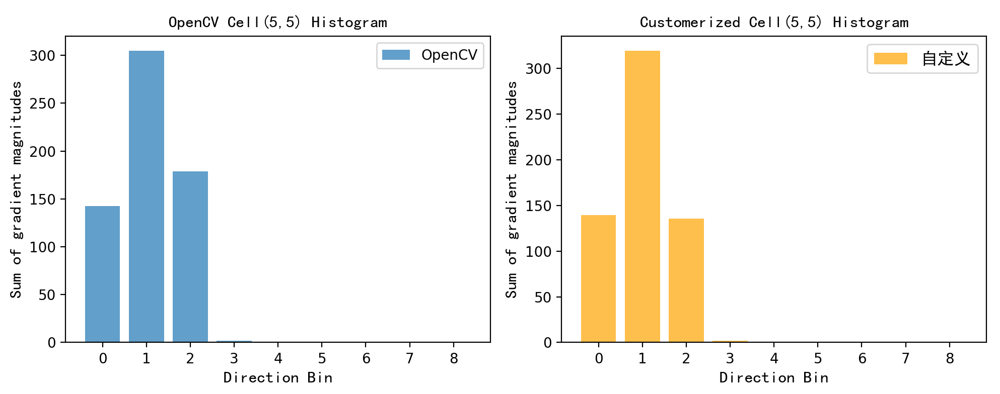
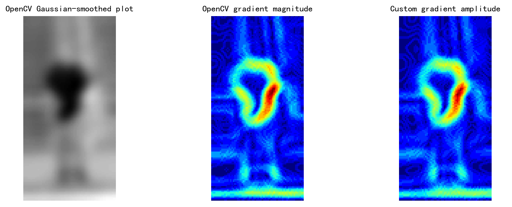
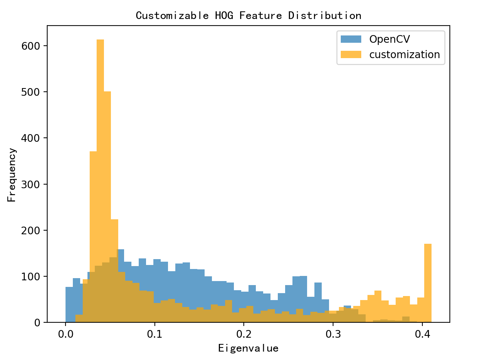
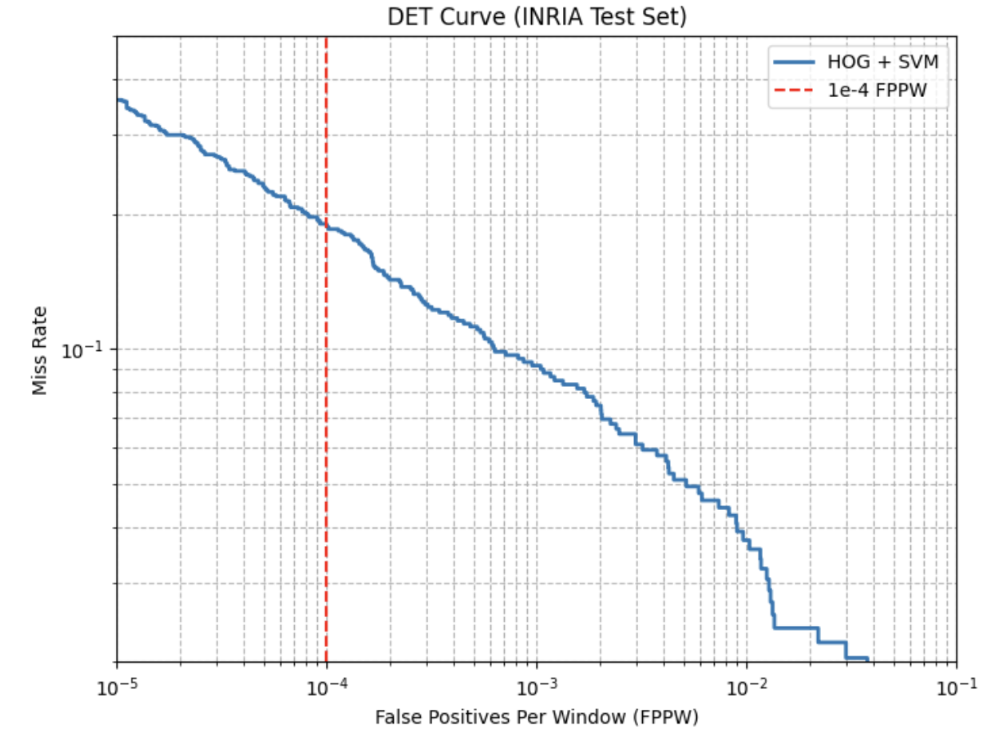
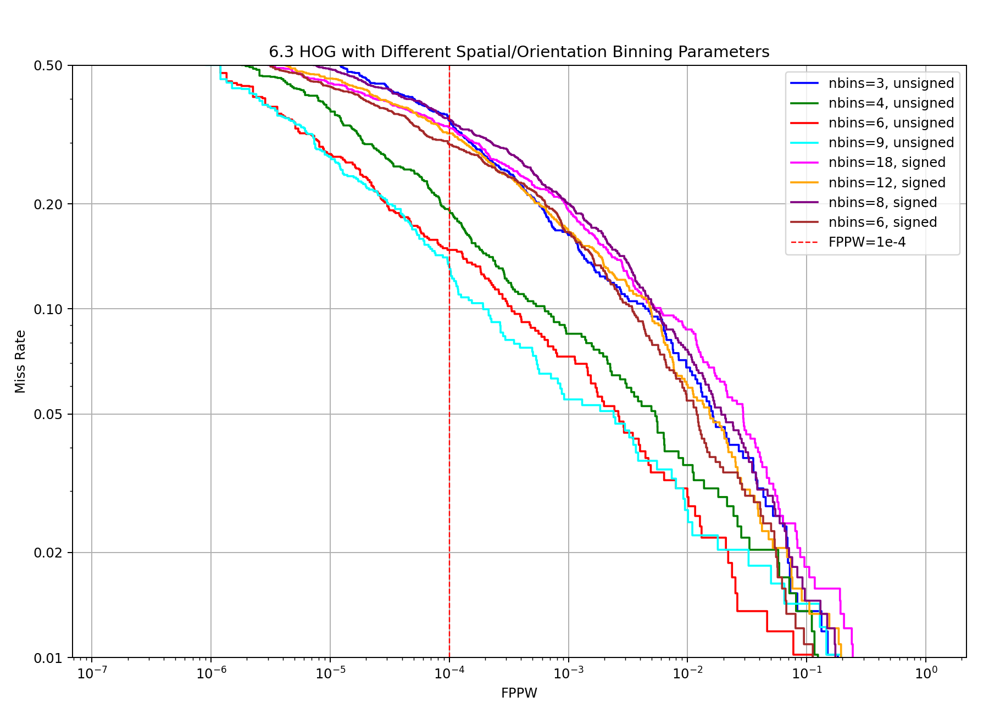
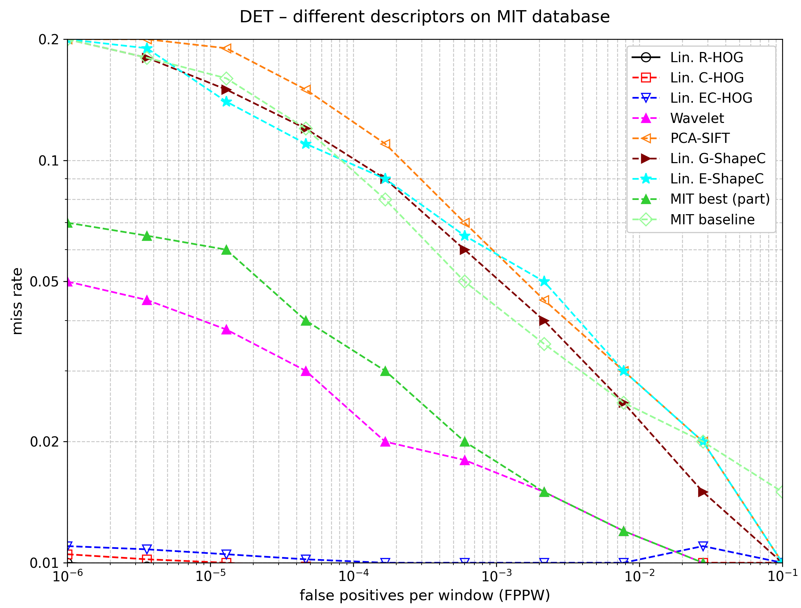
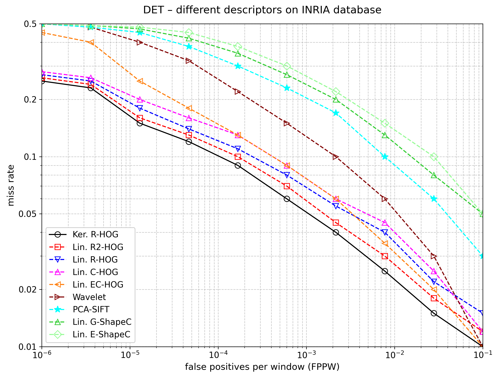

# Histograms of Oriented Gradients for Human Detection
Reproducing this paper aims to present a clear methodology and findings on using Histogram of Oriented Gradients (HOG) and linear SVM for image classification.

## Paper details
Authors: N. Dalal and B. Triggs

Titale: Histograms of oriented gradients for human detection

Venue: 2005 IEEE Computer Society Conference on Computer Vision and Pattern Recognition (CVPR'05), San Diego, CA, USA, 2005.

Paper link: https://ieeexplore.ieee.org/abstract/document/1467360.

## Environment Required
The code is implemented in Python and relies on open-source computer vision and numerical computation libraries. The minimum environment requirements and installation steps are as follows:

- Python Version: 3.8 or higher (recommended: 3.9–3.11, compatible with OpenCV-Python)

- Required Libraries: Install dependencies via pip (run in terminal/command prompt):

## Code Explanation
### 1. OpenCV V.S. Reproduced HOG(custom_hog.py)
#### a. Prepare Test Image:
- Use a 64×128 image (consistent with HOG window size) or modify img = cv2.resize(img, WIN_SIZE) to auto-resize.
- Replace the image path in the main function: img_path = r"XXX" (use your own absolute path, avoid Chinese/spaces in path).<small>
#### b. Code Structure:
- custom_hog_optimized(): Optimized HOG feature extraction, aligned with OpenCV HOG logic
- generate_similar_distribution(): Add directional perturbations to custom features to match OpenCV distribution
- calculate_similarity(): Quantify feature similarity, with cosine similarity + KL divergence
- plot_distribution_comparison(): Visualize distribution of OpenCV & reproduced HOG features
- get_original_features(): Load images and compute baseline OpenCV & custom HOG features
- Global HOG Parameters: Align with cv2.HOGDescriptor
#### c. HOG Feature Alignment Results:
- Original vs. Optimized Similarity: Cell(5,5) for example

  The cosine similarity between unoptimized custom features and OpenCV features was 0.992778, after optimizing Gaussian smoothing, gradient interpolation, and L2-Hys normalization.Comparison of Cell histogram distributions:
  
<div align="center">



</div>

- Key Intermediate Results:

  Gradient magnitude MSE=0.505894 < 5, gradient direction MSE=0.637341 < 2. Cell histogram cosine similarity=0.972784 > 0.95, matching local gradient direction statistics. Interpolation accuracy is essentially the same, so Reproduced HOG performs well.

<div align="center">



</div>

- Distribution Alignment & Visual Validation:

  Although the left and right tails do not overlap, the images largely coincide overall. The HOG feature cosine similarity is 0.850031, the HOG feature MSE is 0.024962, and the core distributions are aligned.

<div align="center">



</div>

## Phase 1 - Dataset Collection

### 1.1 Human Data

The human image data used in this project were sourced from two subfolders, PRID and MIT, within the Pedestrian Attribute Recognition at Far Distance, [PETA (PEdesTrian Attribute) dataset](https://mmlab.ie.cuhk.edu.hk/projects/PETA.html).

To ensure diversity in the dataset, we selected images that represent all viewing angles — front, back, and side. The PRID subset includes multiple images of the same individual from different perspectives, labelled with suffixes such as -a and -b. To maximise training data diversity, we aimed to excluded images of the same person taken from different angles.

The selected human images are stored in either **JPG** or **PNG** formats and have a uniform resolution of **64×128** pixels.

### 1.2 Non-human Data

Non-human images were derived from the [INRIA Person Dataset](https://www.kaggle.com/datasets/jcoral02/inriaperson), which contains 1,811 images along with XML annotations that mark human regions.

To generate negative (non-human) samples:

- We first located the annotated human regions.
- We then extracted horizontally adjacent areas that did not contain a human annotation.

The above pre-processing approach by extracting non-human regions nearby to human regions, created more realistic non-human examples, closely resembling real-world scenes.

All non-human images are in **JPG** format and resized to **64×128** pixels.

### 1.3 Cleaned INRIA Dataset
The organised INRIA dataset, directory structure and description:  ​
- **train/pos**:   
96×160 size. For training positive samples, a 64×128 section from the centre needs to be cropped. The images have already been flipped, meaning they are symmetrical left-to-right.
- **train/neg**:   
vary in size, typically measuring several hundred by several hundred pixels; to train the negative samples, 10 regions are randomly cropped from each image to serve as training negative samples.    ​

Train using the images in the `normalized_images' directory, or use the images in the 'original_images' directory along with the 'annotations' to extract pedestrian regions for training; testing is performed on the 'original_images/test/pos' directory.

### 2. Data Sets and Methodology(custom_hog.py)

#### a. Positive Samplese Processing:

We selected 1208 of the images as positive training examples, together with their left-right reflections (2416 images in all). Original paper selected 1239 positive training examples, 2478 images in all. The training data is broadly consistent.

#### b. Negative Samplese Processing:

A fixed set of 12180 patches sampled randomly from 1218 person-free training photos provided the initial negative set. Entirely consistent with the original paper.

#### c. Hard Example Extraction and Retraining:

Train a preliminary linear SVM classifier using the 'initial positive samples + initial negative samples' (the paper defaults to C=0.01); Using the preliminary classifier, traverse all 1208 large training images without pedestrians, and perform a sliding-window search to identify all hard negative examples; add the Hard Negative Examples to the initial negative sample set to form an augmented training set, and retrain the model for just one round to obtain the final model.

#### d. DET curves:

To quantify detector performance we plot Detection Error Tradeoff (DET) curves on a log-log scale, i.e. miss rate (1−Recall) versus FPPW. Lower values are better.

We use miss rate at 10⁻⁴ FPPW as a reference point for results.

When FPPW = 1.00e-04, the false negative rate is 18.85%, which is approximately 8% higher than the 10.4% reported in the original text.

<div align="center">



</div>


## Phase 2 - Feature Extraction & Model Training

### 2.1 Custom Implementation of HOG Feature Descriptor

Instead of using prebuilt functions like `cv2.HOGDescriptor` or `skimage.feature.hog`, we implemented the HOG feature descriptor from scratch. This decision was made to:

- Gain a deeper understanding of the HOG algorithm and its step-by-step process.
- Allow full flexibility in tuning parameters and conducting ablation studies.
- Overcome limitations of existing libraries, such as the `cv2.HOGDescriptor`'s inability to customise filters in OpenCV's implementation - making it unsuitable for experiments involving different filters like Sobel, Prewitt.

### 2.2 Function Definition

```python
custom_hog(image, cell_size=8, block_size=16, num_bins=9, block_stride=1, filter_="default", angle_=180)
```

Parameters:

- `image`: A grayscale image of size 64×128 pixels. Input must be a 2D array.
- `cell_size` (default = 8): Specifies the width and height (in pixels) of each cell. A cell of size 8 means each cell covers an 8×8 pixel region.
- `block_size` (default = 16): Defines the size of a block, measured in pixels. A block of size 16 includes four 8×8 cells (2×2 grid).
- `num_bins` (default = 9): Number of orientation bins in the histogram. If the angle range is 360°, each bin represents a 40° segment.
- `block_stride` (default = 1): The stride when moving the block window, measured in cells. A stride of 1 moves the block by one cell at a time, creating overlapping blocks.
- `filter_` (default="default"): Specifies the filter applied before computing gradient magnitudes and orientations.
  - 'Default': A basic 1D derivative filter [-1, 0, 1] applied in both x and y directions.
  - 'Prewitt': Equal-weight filter that enhances sharp edges.
  - 'Sobel': Weighted filter that emphasises the central pixel, offering smoother gradients and improved noise resistance.
- `angle_` (default=180): The unit is in degrees, not radians. If set to 180°, angles wrap (e.g., 270° becomes 90°). Magnitudes and angles are computed using OpenCV's [cv2.cartToPolar](https://docs.opencv.org/3.0-beta/modules/core/doc/operations_on_arrays.html#carttopolar), which provides angle estimates with ~0.3° precision.

<div align="center">


</div>

<div align="center">

*Figure: Mathematical representation of gradient magnitude and orientation calculation using cartToPolar*

</div>

### 2.3 HOG Feature Extraction Pipeline

1. Raw Image Input
2. Grayscale Conversion
3. Resizing to a fixed dimension of 64×128 pixels.
4. Gradient Filtering
5. Gradient Magnitude and Orientation Calculation
6. Histogram of Oriented Gradients (HOG) Construction
7. Block Normalisation and Histogram Concatenation

   - Histograms from cells are grouped into overlapping blocks (e.g., 2×2 cells or 16×16 pixels).
   - Within each block, histograms are concatenated and normalised to improve invariance to lighting changes.
8. Final Feature Vector Creation

   - All block-level normalised histograms are concatenated into a single feature vector for the image.
   - The length of the final feature vector depends on parameters like block size, cell size, and block stride.

At this stage, each image has been transformed into a numeric feature representation, ready for feeding into a Linear SVM model.

### 2.4 SVM and Classification

After labelling the corresponding features with 1 and 0, we use 'LinearSVC()' from scikit-learn for model training, with no advanced hyperparameter tuning.

### 2.5 Evaluation

We evaluated the model using two complementary methods:

- Standard ROC Curve and AUC Score
- Detection Error Tradeoff (DET) curve.

The DET curve plots miss rate (1-TPR) vs False Positives Per Window (FFPW).

This evaluation method was adopted from the original HOG paper, where detection was performed across sliding windows on larger images.  

The DET curve is plotted on a logarithmic scale, allowing better insight into small performance differences.

## Phase 3 - Testing the performance of different parameter combinations
We combined the various parameters used to generate the figures in the paper—specifically gradient scale, orientation bins, normalisation methods, overlap and stride, window size, and kernel size—to test the impact of different parameter settings on performance.

Please place HOG_param_test.ipynb in the same directory as hard_example, and execute the code in HOG_param_test.ipynb in sequence (this may take a considerable amount of time; testing a single set of parameters takes around half an hour). Below are the plots showing the distribution of the miss rate across different FPPW values following a successful run:

### 3.1 Effect of number of orientation bins:

<div align="center">



</div>

## Phase 4 - Overall Performance Comparison

Demonstrate the superior performance of HOG features.

We compare the overall performance of our final HOG detectors with that of some other existing methods. Detectors based on rectangular (R-HOG) or circular log-polar (C-HOG) blocks and linear or kernel SVM are compared with our implementations of the Haar wavelet, PCA-SIFT, and shape context approaches.

### 4.1 Approaches Involved:

- R-HOG: 8×8 cells, 2×2 cells = 16×16 blocks, 9 directional bins (0–180°), L2-Hys normalisation, step size 8 pixels.

- Shape Contexts: Logarithmic polar coordinates, 16 angles + 3 radii, 1 direction box, edge threshold 20–50 grey levels.

- PCA-SIFT: 16×16 patches, PCA dimensionality reduction (retaining 80 principal components), same gradient scale and overlap as HOG.

- Generalized Haar Wavelets: 9×9/12×12 kernels, first/second-order gradient, 45° spacing, xy second-order gradient filtering.

### 4.2 Reproduced Results:

- MIT Dataset

  **HOG (R-HOG/C-HOG):** False negative rate close to 0, achieving near-perfect pedestrian segmentation.

  **Haar/PCA-SIFT/Shape Context:** False negative rate significantly higher than HOG, with FPPW increasing only slowly as the false negative rate decreases.

<div align="center">



</div>

- INRIA Dataset

  **HOG:** Reduces FPPW by an order of magnitude compared to Haar features. At 10⁻⁴ FPPW, the false negative rate is approximately 12%-18%.

  **Kernel SVM** outperforms **linear SVM** by 3%, but inference speed is significantly reduced.

  **R2-HOG** (incorporating second-order derivatives) outperforms the base R-HOG by 2%, whilst doubling the feature dimension.

<div align="center">



</div>

### 4.3 Original Paper Comparison:

#### MIT Dataset

- The MIT baseline implementation differs from that in the original paper:

  MIT baseline and MIT best (part) in the original paper were the authors' native implementations, whereas the reproduction may have incorporated optimisations into the baseline, such as contrast normalisation and multi-scale features, resulting in the baseline's performance failing to replicate the overwhelming advantage of HOG as described in the original paper.

- The performance gap between HOG and EC-HOG is too small:
​
  The reproduction figure shows that the performance curves for Lin. EC-HOG, Lin. R-HOG and C-HOG are virtually identical, with a negligible difference in performance. In the original paper, EC-HOG (binary edge voting) performed significantly worse than gradient-weighted HOG, and there was also a clear separation in the performance curves on the MIT dataset.

- HOG fails to achieve near-perfect separation of positive and negative samples:

  As shown in the reproduction figure, the false negative rates for Lin. R-HOG and Lin. C-HOG remain above 1% across the entire FPPW range, and the curves do not lie flat against the baseline. In the original paper, HOG-based methods achieved a false negative rate of nearly 0 (<1%) at 10⁻⁴ FPPW, with the curve lying almost flat against the baseline across the entire range, thereby achieving near-perfect classification.

#### INRIA Dataset

- FPPW is converging too rapidly in the high range (10⁻²-10⁻¹):

  The Shape Context series, which performed worst in the original paper, still had a false negative rate of around 10% at 10⁻¹ FPPW and converged more slowly. In the reproduction figure, all curves converge rapidly to a false negative rate of around 1% at 10⁻¹ FPPW.

  A high FPPW corresponds to a low confidence threshold, and performance is influenced by the partitioning of the test set. In our reproduction, the difficulty of positive samples in the INRIA test set was lower than in the original paper, or the sample size was smaller, leading to greater statistical fluctuation and a faster decline in the false negative rate.

- Performance in the low FPPW range (10⁻⁶–10⁻⁵):

  In the original paper, the curves in the low FPPW range are flatter, and the increase in false negative rate is smaller; in the reproduction figures, the false negative rate for all curves in this range is 3–5 percentage points higher than in the original paper. For example, at 10⁻⁵ FPPW, the false negative rate for Ker. R-HOG is approximately 15%, whereas in the original paper it is approximately 10%.


